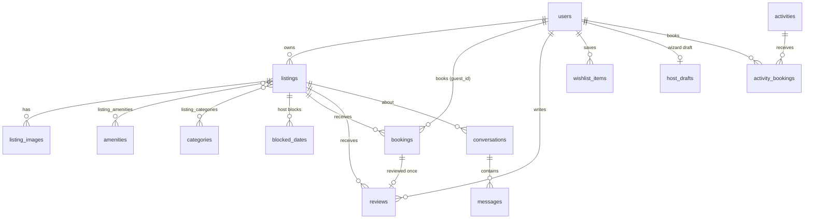

# Airbnb clone — full-stack (Next.js + FastAPI + SQLite/Postgres)

A working Airbnb-style marketplace: search and filter stays, view listings, book with real availability checks, manage trips, wishlist, review stays, and host (create/edit/delete listings, calendar, reservations, inbox). Dark theme by default with a sun/moon toggle on every page.

```
frontend/   Next.js 14 (App Router) · TypeScript · Tailwind
backend/    FastAPI · SQLAlchemy 2 · SQLite locally / PostgreSQL when deployed · JWT auth · pytest suite
tools/      one-off exporter that produced backend/app/seed_data/seed.json from the original UI content
```

## Quick start

**Backend** (Python 3.11+; developed on 3.13)

```bash
cd backend
python -m venv .venv && source .venv/bin/activate      # Windows: .venv\Scripts\activate
pip install -r requirements-dev.txt
uvicorn app.main:app --reload --port 8000              # creates airbnb.db (SQLite) and seeds it on first start
pytest -q                                              # 24 API tests
```

API docs: <http://localhost:8000/docs> · health check: `/api/health`.
Reset the data: `python -m app.seed --reset`.

**Frontend** (Node 18+)

```bash
cd frontend
cp .env.example .env.local        # NEXT_PUBLIC_API_URL=http://localhost:8000
npm install
npm run dev                       # http://localhost:3000
```

Or run both with Docker: `docker compose up --build`.

**Deploying to Vercel (everything persistent):** see [DEPLOY.md](DEPLOY.md).

### Demo accounts (password for all: `password123`)

| Role | Email |
|---|---|
| Guest (has a past stay to review, an upcoming trip and a wishlist) | `guest@demo.com` |
| Host (owns listings with reservations, one needing approval, plus messages) | `kamal@host.demo` (also `priya`, `rohan`, `anjali`, `vikram`, `meera`, `arjun`, `sneha` `@host.demo`) |

"Continue with Google / Apple" are demo buttons that sign you in as a demo user. Any new account created through the sign-up form works as both guest and host — hosting is simply "Switch to hosting".

## What is implemented

| Area | Features |
|---|---|
| Home & search | Listing cards with photo carousel, search bar (where / dates / guests with suggestions), category row, filters modal (type of place, price, rooms, property type, amenities, instant book, self check-in, free cancellation, guest favourite) with live result count, sort, infinite scroll (server pagination), map toggle (price pins from `/listings/map`) |
| Listing detail | Gallery, description, amenities, availability calendar (booked/blocked nights disabled), price breakdown from the server, reviews with sub-ratings, rating histogram and "guests mention" topic filter, host card (Superhost badge, aggregated rating), nearby stays, wishlist heart |
| Booking | Date, guest and pet validation; overlapping or past dates rejected (409/422); atomic availability check + insert; instant book vs. request-to-book (host approves/declines); mocked card/UPI checkout (no card data is sent or stored); cancel (releases dates); My Trips with upcoming/past/cancelled; bookings block the calendar |
| Reviews | A guest can review once, only after a completed stay; listing rating and review count are recomputed; Superhost = ≥ 20 reviews and ≥ 4.8 rating |
| Wishlist | Per user, for stays, experiences and services |
| Hosting | Earnings landing page, 19-step listing wizard (autosaved drafts on the server, 5+ photo upload, validation on publish), listings dashboard (create / edit / delete), reservations dashboard (today/upcoming, approve/decline), calendar (block/unblock dates, base price, discounts, cancellation), inbox |
| Experiences & services | Browse, search by place/type, detail, booking |
| Account | Profile (about me, interests, photo upload), account pages, log in / out |
| Polish | Modals, toasts, skeleton loaders, responsive layout, dark default + light mode |
| Placeholders (as allowed) | Payments, live map tiles, identity verification, guest-side messaging UI ("Coming soon" pages) |

## Architecture

```
Browser ── Next.js (client components, fetch) ──► FastAPI /api ──► SQLAlchemy ──► SQLite (local dev)  or  PostgreSQL (Vercel/Neon)
                                                    │
                                                    └──► /uploads/<file>  (images stored in the database, so they persist everywhere)
```

* **Frontend** — App Router pages; `lib/api.ts` is a small typed fetch wrapper (bearer token in `localStorage`); `lib/store.tsx` holds only session state (user, wishlist ids, host-wizard draft, theme, search bar). Everything else is fetched per page.
* **Backend** — routers (`app/routers`) are thin; business rules live in `app/services` (`pricing`, `availability`, `booking_rules`, `search`, `reviews`, `listing_writer`). The server is the source of truth for prices and availability: the UI asks `/listings/{id}/quote`, and `POST /bookings` recomputes the total itself.
* **Concurrency** — on SQLite every write route opens its transaction with `BEGIN IMMEDIATE`; on PostgreSQL the booking route locks the listing row (`SELECT … FOR UPDATE`). Either way "check overlap, then insert" cannot interleave with another booking (covered by a threaded test that fires six simultaneous bookings for the same dates and expects exactly one `201`).
* **Auth** — email + password (PBKDF2-SHA256, 120k iterations), JWT (HS256, 7 days) in `Authorization: Bearer`. Guest and host are roles of the same user (`users.is_host` is set when they publish a listing); ownership is enforced on every `/host/*` route (other people's listings return 404).

### Business rules

* **Nights** are the half-open range `[check_in, check_out)`. Back-to-back stays (checkout day = next check-in) are allowed.
* A date is unavailable if a `pending`/`confirmed` booking overlaps it or the host blocked it. `cancelled`/`declined` bookings free the dates.
* **Pricing** — Fri/Sat nights add the listing's weekend %; one best discount per stay from those the host enabled: new listing 20 % (first 3 bookings), last-minute 3 % (check-in within 14 days), weekly 10 % (7+ nights), monthly 15 % (28+ nights); cleaning fee `round(price × 0.18, −1) + 250`; service fee 14 % of (subtotal − discount + cleaning).
* Pets are accepted only if the listing has the `pets` amenity; guests (adults + children) ≤ `max_guests`; hosts cannot book their own listing.

## Database schema (SQLite locally, PostgreSQL in production — same models)



| Table | Key columns / constraints |
|---|---|
| `users` | `id` PK, `email` UNIQUE, `password_hash`, `first_name`, `last_name`, `dob`, `avatar_url`, `is_host`, `profile` JSON, `created_at` |
| `listings` | `id` PK, `owner_id` → users, title, kind, place (`entire/room/shared`), city/area/state, private `address`/`pin`, `lat`/`lng`, `price`, `max_guests`, `bedrooms`, `beds`, `baths`, description, `instant_book`, `self_check_in`, `free_cancel`, `guest_favourite`, `status` (`published/unlisted`), `weekend_pct`, `discounts` JSON, safety/camera/business fields, denormalised `rating` + `review_count`, `rank` (recommended order) |
| `listing_images` | `listing_id` → listings (cascade), `url`, `position` |
| `amenities`, `categories` | lookup tables; joined via `listing_amenities`, `listing_categories` (composite PKs) |
| `blocked_dates` | `listing_id`, `day`; UNIQUE (`listing_id`,`day`) |
| `bookings` | `code` UNIQUE, `listing_id`, `guest_id`, `check_in`, `check_out`, guests (adults/children/infants/pets), `nights`, price snapshot (`nightly`, `subtotal`, `discount_*`, `cleaning_fee`, `service_fee`, `total`), `status` (`pending/confirmed/cancelled/declined`), `payment_method`; CHECK `check_out > check_in`; indexed on (`listing_id`,`check_in`,`check_out`) |
| `reviews` | `listing_id`, `booking_id` UNIQUE (one review per stay), `author_id`, `stars` + five sub-ratings, `text`, created_at |
| `wishlist_items` | `user_id`, `item_type` (`listing/experience/service`), `item_id`; UNIQUE per user+item |
| `conversations` / `messages` | one conversation per (listing, guest); messages belong to a conversation and have a `sender_id` |
| `uploaded_files` | uploaded images (`name` PK, `content_type`, `data` BLOB, `owner_id`) served at `/uploads/<name>` |
| `host_drafts` | one per owner: `step`, `listing_id` (when editing an existing listing), `data` JSON |
| `activities`, `activity_bookings` | experiences and services, and reservations for them |

Foreign keys are enforced (`PRAGMA foreign_keys=ON`); deleting a listing cascades to its images, bookings, blocked dates and reviews.

**Seed data** (`app/seed.py`, runs automatically when the DB is empty): 8 hosts, 12 guests, 88 stays across Manali, Chandigarh, Shimla, Zirakpur, Gurugram, Kharar, North Goa and Kasauli with varied photos, ~180 bookings (some pending), ~6,400 generated reviews whose averages match each listing's rating, conversations, 35 experiences and 14 services.

## API overview

Base path `/api`. JSON and query params use camelCase. Errors are `{"detail": "..."}` with 401 (not signed in), 404 (not found / not yours), 409 (dates unavailable), 422 (validation / rules). Interactive docs at `/docs`.

| Method & path | Purpose |
|---|---|
| `POST /auth/check` · `/auth/signup` · `/auth/login` · `/auth/demo` | account flow |
| `GET/PATCH /auth/me` · `POST /auth/me/become-host` | profile |
| `GET /listings` | search: `where, checkIn, checkOut, adults, children, infants, pets, category, minPrice, maxPrice, place, bedrooms, beds, baths, kinds, amenities, instantBook, selfCheckIn, freeCancel, favourite, sort, page, pageSize` |
| `GET /listings/count` · `/listings/map` · `/listings/collections?cities=` | filter count, map pins, home rows |
| `GET /listings/{id}` · `/{id}/quote` · `/{id}/reviews?topic=` · `/{id}/nearby` | detail, price + availability, reviews, similar stays |
| `POST /bookings` · `GET /bookings/mine` · `GET /bookings/{id}` · `POST /bookings/{id}/cancel` · `POST /bookings/{id}/review` | booking lifecycle |
| `GET/PUT /wishlist` · `DELETE /wishlist/{type}/{id}` | wishlist |
| `GET /activities?kind=&where=&type=` · `GET /activities/{id}` · `POST /activity-bookings` · `GET /activity-bookings/mine` | experiences & services |
| `GET/POST /host/listings` · `GET/PUT/PATCH/DELETE /host/listings/{id}` | host CRUD |
| `PUT /host/listings/{id}/blocked-dates` · `GET /host/listings/{id}/bookings` | calendar |
| `GET /host/bookings?scope=all\|today\|upcoming` · `PATCH /host/bookings/{id}` | reservations, approve/decline |
| `GET/PUT/DELETE /host/draft` · `POST /host/draft/publish` | listing wizard |
| `GET /host/conversations` · `GET /conversations` · `POST /conversations/{id}/messages` | messaging |
| `GET /meta/amenities` · `/meta/categories` · `/meta/places?q=` | lookups |
| `POST /uploads` | image upload (JPEG/PNG/WebP/GIF, ≤ 8 MB, type checked from file bytes) |

## Deployment

Both apps deploy to **Vercel** as two projects (root directory `backend` and `frontend`). Vercel has no persistent disk, so the deployed backend uses a free hosted **PostgreSQL** (Neon / Vercel Postgres) through `DATABASE_URL`; uploaded photos are stored in that database too, so users, bookings, listings, wishlists, reviews and photos all persist. Step-by-step instructions are in [DEPLOY.md](DEPLOY.md). Locally the same code runs on a SQLite file with no setup.

## Assumptions & limitations

* Payments are mocked: card/UPI details are validated in the browser and never leave it; the booking records only the payment method.
* Listing photos in the seed data are hot-linked from the original design assets, so the UI needs internet access to show them. Photos uploaded through the app are stored in the database (`uploaded_files`); the browser downsizes big photos before upload because serverless request bodies are limited to ~4.5 MB.
* The map is a price-pin overview (no tiles); identity verification and guest-side messaging UI are "Coming soon" placeholders.
* Currency is INR; dates are calendar days in the server's timezone; there are no emails/notifications.
* Passwords are ≥ 8 characters; there is no password reset flow.

## Testing

`cd backend && pytest -q` (SQLite) or `TEST_DATABASE_URL=postgres://… pytest -q` (PostgreSQL — both pass) covers search/filters/availability, quotes vs. booked totals, discounts, double-booking (incl. 6 concurrent requests), cancel/release, host approve/decline, reviews after a stay, wishlist, activities, the host wizard + CRUD + calendar, ownership checks, auth validation and uploads. The frontend was additionally exercised end-to-end in a headless browser against the running servers (browse, search, filters, login, book, overlap rejection, review, wishlist, host dashboards, wizard with photo upload and publish).
